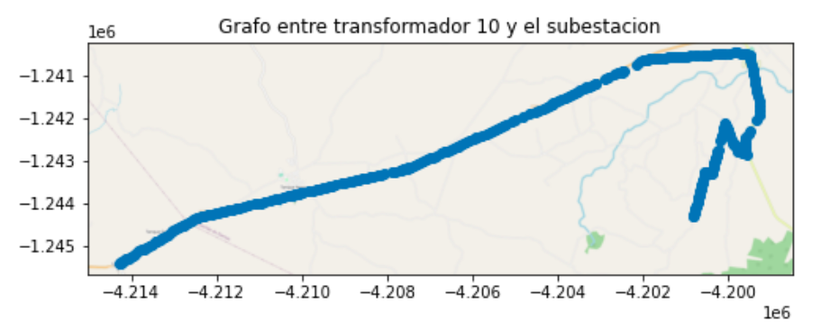

# Analysis and Curation

## Description of the dataset

The dataset provided by contains the geographic database of ANEEL (National Agency of Electric Energy in Brazil) 2018. The dataset contains geographic data of the consumers and of all the assets of the distributor. One of the biggest challenges in this industry is knowing the drivers behind Service Quality that allow efficient decisions to be made on operating costs and investments. The objective of this project is to identify and apply different techniques of analysis / data processing to generate relevant information for decision-making.

## Data Curation/ Feature Engineering

The dataset allows us to apply the following concepts:
* Data loading: Encodings, Special Characters, formats
* Classification of types of variables in continuous, ordinal and categorical
* Methods of normalization of continuous variables
* Coding of ordinal and categorical variables
* Imputation of invalid values and outliers
* Feature engineering using graphs trees and geospatial references
